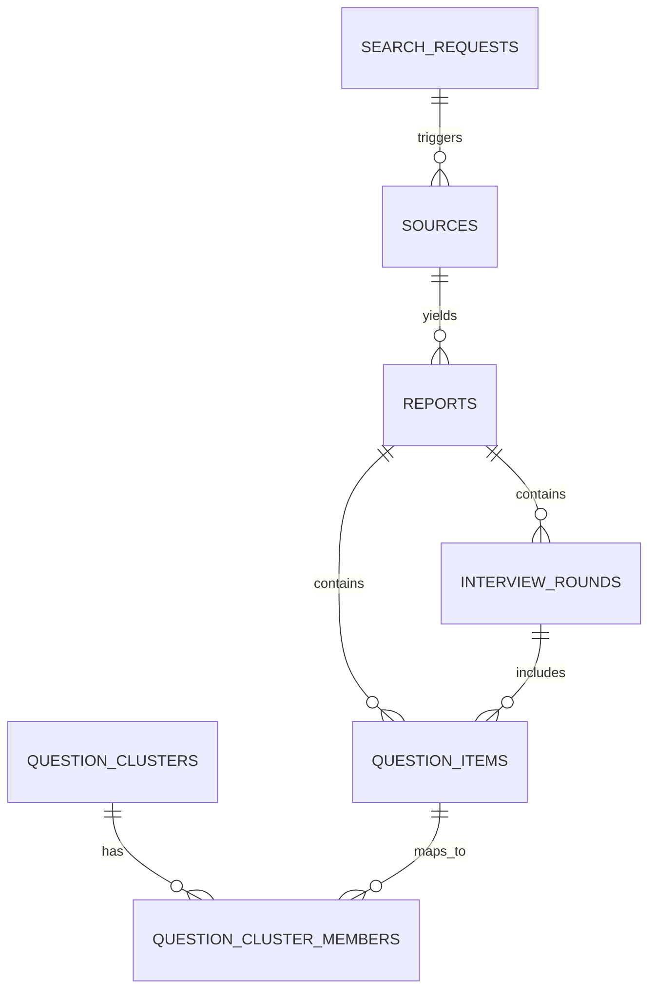

# Database Design

## 1. 设计目标

数据库需要同时支持四类能力：

- 保存用户查询和查询状态
- 保存原始网页和清洗后的文本
- 保存 LLM 抽取后的结构化面经数据
- 保存聚合结果和问题聚类，提升重复查询性能

MVP 阶段优先选择 Postgres，原因是：

- 结构化字段和关系查询方便
- `JSONB` 足够灵活，适合半结构化抽取结果
- 后续可自然接入 `pgvector`

## 2. 核心实体

### `search_requests`

记录用户发起的查询。

关键字段：

- `company_input`
- `role_input`
- `direction_input`
- `normalized_query`
- `status`
- `result_cache_key`

### `sources`

记录网页来源和抓取结果。

关键字段：

- `canonical_url`
- `domain`
- `title`
- `publish_date`
- `raw_html`
- `clean_text`
- `content_hash`
- `fetch_status`

### `reports`

一条 `report` 表示“从某个来源中抽取出的一份面经结构化记录”。

关键字段：

- `source_id`
- `company_name`
- `role_name`
- `direction_name`
- `candidate_level`
- `city`
- `overall_result`
- `overall_confidence`
- `published_at`
- `raw_extraction_json`

### `interview_rounds`

记录单份面经中的各轮面试。

关键字段：

- `report_id`
- `round_index`
- `round_name`
- `interviewer_type`
- `duration_minutes`
- `topic_summary`
- `question_count`

### `question_items`

保存从面经中抽出的单个问题。

关键字段：

- `report_id`
- `round_id`
- `raw_question`
- `normalized_question`
- `topic_tag`
- `evidence_snippet`

### `question_clusters`

把语义相近的问题归为一类，用于高频问题统计。

关键字段：

- `cluster_key`
- `company_name`
- `role_name`
- `direction_name`
- `canonical_question`
- `topic_tag`
- `sample_count`

### `question_cluster_members`

维护问题和聚类之间的映射关系。

## 3. ER 关系图



## 4. 表结构建议

### `search_requests`

```sql
create table search_requests (
  id uuid primary key,
  company_input text not null,
  role_input text not null,
  direction_input text,
  normalized_query jsonb not null,
  status text not null default 'pending',
  result_cache_key text,
  created_at timestamptz not null default now()
);
```

### `sources`

```sql
create table sources (
  id uuid primary key,
  request_id uuid references search_requests(id),
  canonical_url text not null unique,
  domain text not null,
  title text,
  publish_date date,
  author_name text,
  raw_html text,
  clean_text text,
  content_hash text not null,
  relevance_score numeric(5,4),
  fetch_status text not null default 'queued',
  fetched_at timestamptz,
  created_at timestamptz not null default now()
);

create index idx_sources_domain on sources(domain);
create index idx_sources_hash on sources(content_hash);
```

### `reports`

```sql
create table reports (
  id uuid primary key,
  source_id uuid not null references sources(id),
  company_name text not null,
  role_name text not null,
  direction_name text,
  candidate_level text,
  city text,
  application_channel text,
  overall_result text,
  overall_confidence numeric(5,4),
  timeline_json jsonb,
  raw_extraction_json jsonb not null,
  published_at date,
  created_at timestamptz not null default now()
);

create index idx_reports_company_role on reports(company_name, role_name);
```

### `interview_rounds`

```sql
create table interview_rounds (
  id uuid primary key,
  report_id uuid not null references reports(id),
  round_index int not null,
  round_name text not null,
  interviewer_type text,
  duration_minutes int,
  topic_summary text,
  round_result text,
  created_at timestamptz not null default now()
);
```

### `question_items`

```sql
create table question_items (
  id uuid primary key,
  report_id uuid not null references reports(id),
  round_id uuid references interview_rounds(id),
  raw_question text not null,
  normalized_question text,
  topic_tag text,
  evidence_snippet text,
  embedding vector(1536),
  created_at timestamptz not null default now()
);
```

### `question_clusters`

```sql
create table question_clusters (
  id uuid primary key,
  cluster_key text not null unique,
  company_name text not null,
  role_name text not null,
  direction_name text,
  canonical_question text not null,
  topic_tag text,
  sample_count int not null default 0,
  created_at timestamptz not null default now(),
  updated_at timestamptz not null default now()
);
```

### `question_cluster_members`

```sql
create table question_cluster_members (
  cluster_id uuid not null references question_clusters(id),
  question_item_id uuid not null references question_items(id),
  primary key (cluster_id, question_item_id)
);
```

## 5. 去重策略

MVP 阶段建议结合三层去重：

- URL 规范化：去掉跟踪参数
- 内容哈希：相同正文直接去重
- 语义近似：标题和正文高度相似时标记为转载

## 6. 聚合结果缓存

为了让常见查询更快返回，可以增加一张缓存表。

```sql
create table query_summaries (
  id uuid primary key,
  cache_key text not null unique,
  company_name text not null,
  role_name text not null,
  direction_name text,
  sample_size int not null,
  summary_json jsonb not null,
  generated_at timestamptz not null default now()
);
```

## 7. 为什么这样设计

- `sources` 和 `reports` 分开：原始网页和抽取结果生命周期不同
- `reports` 和 `interview_rounds` 分开：便于时间线展示
- `question_items` 单独存：便于做聚类和统计
- `query_summaries` 做缓存：重复查询时可以快速响应

## 8. MVP 可以简化的地方

如果你想在面试前更快做出 demo，可以先省掉：

- `question_cluster_members`
- `embedding`
- `query_summaries`

先保留：

- `sources`
- `reports`
- `interview_rounds`
- `question_items`

这样已经足够支撑第一版结果页。
